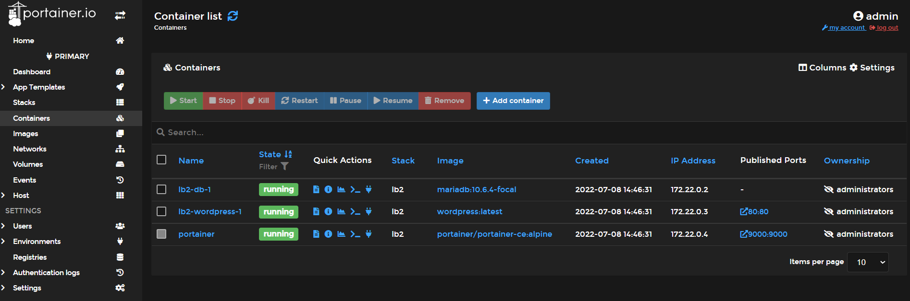

# Einleitung
Die LB02 Projektarbeit von Kimo Strupler und Lukas Sägesser wird hier in den folgenden Zeilen dokumentiert. 


# Projekt-Idee

Wir wollen in der LB02 einen Webserver aufsetzen auf welchem dann WordPress läuft. Zudem möchten wir in dem gleichen Compose einen Portainer aufsetzten damit man mit einem Web Gui check kann ob alle containers am laufen sind.
Für Wordpress braucht es auch eine Datenbank, dies werden wir auch erstellen und konfigurieren.
Es wird ähnlich sein wie das Video:
https://www.youtube.com/watch?v=kIqWxjDj4IU&t=301s

Was ist ein Portainer?
"Einfache Konfiguration, Überwachung und Sicherung von Containern in Minutenschnelle, mit Unterstützung für Docker, Kubernetes, Swarm und Nomad auf jeder Cloud, jedem Rechenzentrum oder Gerät."

Jedoch ist das video zu komploziert und man muss Wordpress herunterladen. Dies haben wir anderst gelöst. 
Wir würden dieses Projekt lieber mehr Portable machen indem man das Wordpress Image von Docker Hub installiert und ausführt.

## Services:
Wordpress:
https://hub.docker.com/_/wordpress

MYSQL:
https://www.mysql.com/de/
oder
MiriamDB:
https://hub.docker.com/_/mariadb
https://mariadb.org/


# Inhaltsverszeichnis
1. Projekt
2. Service-Aufbau
3. Umsetzung
4. Testing
5. Quellen

## Projekt
Projekt Struktur:
```
.
├── compose.yaml
└── README.md
```

## Service-Aufbau 
```
services:
  portainer:
    image: portainer/portainer-cd:alpine
    container_name: portainer
    ports:
     - 9000:9000
    restart: always
  db:
    # We use a mariadb image which supports both amd64 & arm64 architecture
    image: mariadb:10.6.4-focal
    ...
  wordpress:
    image: wordpress:latest
    ports:
      - 80:80
    restart: always
    ...
```
## Umsetzung

```
$ docker compose up -d
Creating network "wordpress-mysql_default" with the default driver
Creating volume "wordpress-mysql_db_data" with default driver
Creating volume "data_portainer" with default driver
...
Creating wordpress-mysql_db_1        ... done
Creating wordpress-mysql_wordpress_1 ... done
Creating portainer                   ... done
```

## Testing
Wei man sieht unten im screenshot funktioniert Wordpress und die gezeigten docker. Portainer Funktioniert auch. Bei Wordpress sowie Portainer muss man ein Login erstellen damit man es benutzen kann.

## Erwartetes Ergebnis

Check containers are running and the port mapping:
```
$ docker ps
CONTAINER ID        IMAGE               COMMAND                  CREATED             STATUS              PORTS                                        NAMES
5fbb4181a069        wordpress:latest    "docker-entrypoint.s…"   35 seconds ago      Up 34 seconds       0.0.0.0:80->80/tcp                           wordpress-mysql_wordpress_1
e0884a8d444d        mysql:8.0.19        "docker-entrypoint.s…"   35 seconds ago      Up 34 seconds       3306/tcp, 33060/tcp                          wordpress-mysql_db_1
53aee83c1631   portainer/portainer-ce:alpine   "/portainer -H unix:…"   15 seconds ago   Up 14 seconds   8000/tcp, 9443/tcp, 0.0.0.0:9000->9000/tcp   portainer
```

Navigate to `http://localhost:80` in your web browser to access WordPress.


Navigate to `http://localhost:9000` in your web browser to access Protainer


Stop and remove the containers

```
$ docker compose down
```

To remove all WordPress data, delete the named volumes by passing the `-v` parameter:
```
$ docker compose down -v
```

## Quellen
https://www.youtube.com/watch?v=kIqWxjDj4IU&t=301s
https://www.mysql.com/de/
https://www.php.net/manual/de/intro-whatis.php
https://hub.docker.com/_/wordpress